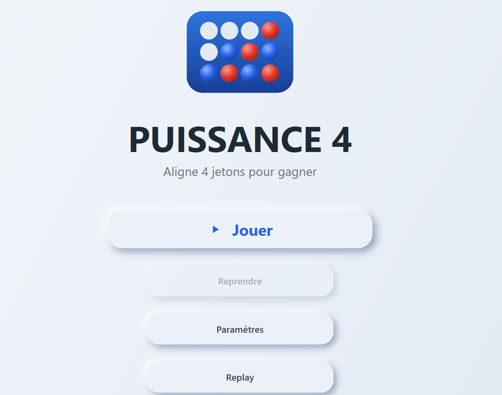
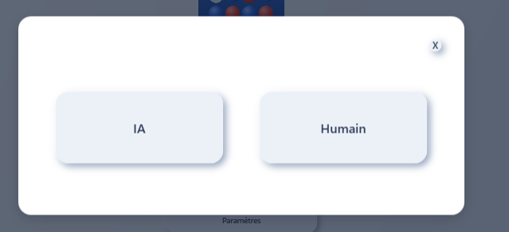
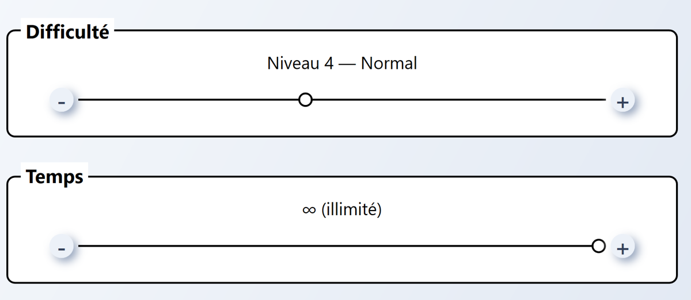
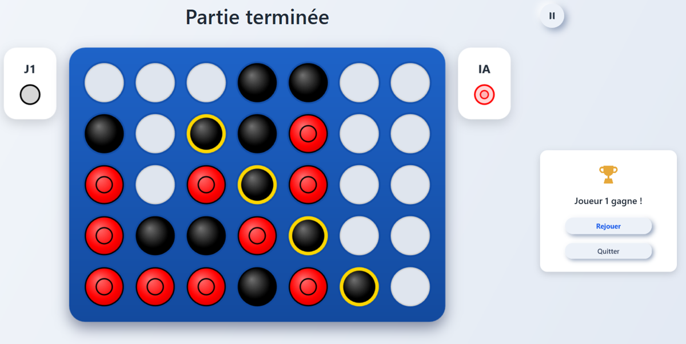

# Puissance 4  application C# avec adversaire IA

Application de bureau (C# / WPF) du jeu de Puissance 4, avec un adversaire artificiel basé sur
l'algorithme Minimax et une heuristique d'évaluation conçue pour fonctionner sur **n'importe quelle
taille de grille** et **n'importe quel nombre de jetons à aligner**.



## Le problème

Le sujet imposait deux choses : une interface pensée à partir de trois personas aux besoins très
différents (une retraitée qui a besoin de gros contrastes, un prof de maths qui veut un adversaire
coriace et des parties chronométrées, un lycéen qui veut personnaliser son jeu), et une IA
**généralisable** : grille de taille variable, aligner 5 jetons au lieu de 4…

La difficulté n'est pas le Minimax lui-même, c'est la fonction d'évaluation. C'est elle qui décide
si une position est bonne ou mauvaise quand on ne peut pas explorer l'arbre jusqu'au bout : sur une
grille 6×7, l'arbre complet compte jusqu'à 7⁴² nœuds.

## Fonctionnalités

- Parties **Humain contre Humain** ou **Humain contre IA**
- **10 niveaux de difficulté** (profondeur de recherche de l'IA)
- **Minuteur par coup** réglable, de quelques secondes à illimité ; le tour est sauté si le temps est écoulé
- Taille de grille et nombre de jetons à aligner configurables
- Personnalisation des jetons (formes et couleurs)
- Mode **Challenge** : plusieurs manches d'affilée contre le même adversaire
- Mise en évidence des jetons gagnants en fin de partie

| Choix de l'adversaire | Réglages de la partie |
|---|---|
|  |  |



## Technologies

- **Langage** : C# (.NET 10)
- **Interface** : WPF
- **Conception** : programmation orientée objet (classe abstraite, héritage, polymorphisme)
- **Algorithmique** : Minimax, élagage alpha-bêta, fonction d'évaluation heuristique
- **Outils** : Visual Studio

## Architecture

La solution contient deux projets. `SAE_IHM_Systeme` porte toute la logique du jeu et l'IA ;
`SAE_IHM_Interface` est l'application WPF. L'interface ne connaît ni les règles ni l'algorithme de
l'IA : elle demande un coup et affiche le résultat.

```
SAE_IHM_Systeme/        # le moteur
├── Pion                # jeton posé sur la grille
├── Grille              # plateau, placement, détection de victoire, copie profonde
├── Joueur              # classe abstraite : ChoisirColonne(grille)
│   ├── JoueurHumain
│   └── JoueurIA        # délègue le choix du coup à AlgoMinMax
├── Noeud               # nœud de l'arbre de recherche
├── Heuristique         # évaluation d'une position → score entier
├── AlgoMinMax          # Minimax + élagage alpha-bêta
├── Configuration       # paramètres de la partie
└── Partie              # orchestration : tours, minuteur, mode Challenge

SAE_IHM_Interface/      # l'application WPF
├── FenetreAccueil
├── FenetreJeu          # la grille, le déroulement des tours, la fin de partie
├── FenetreParametresJeu / FenetreParametresPartie
├── FenetreIA / FenetreHumain
└── FenetreReplay
```

Faire de `Joueur` une classe abstraite permet à la `Partie` de traiter un humain et une IA
exactement de la même façon : elle demande une colonne, sans savoir qui répond.

## L'heuristique

Tous les poids sont exprimés en fonction de **N**, le nombre de jetons à aligner, pour que
l'évaluation garde le même comportement quelle que soit la configuration :

| Situation | Score |
|---|---|
| Victoire immédiate | + N³ × 100 |
| Double menace adverse (fourchette) | − N³ × 90 |
| Coup cadeau (ouvre une victoire à l'adversaire) | − N³ × 90 |
| Alignement à N − 1 jetons | + N² × 10 |
| Contrôle du centre | + N × 5 |
| Alignement à N − 2 jetons | + N × 1 |

Cette hiérarchie garantit trois comportements : l'IA joue toujours un coup gagnant s'il existe,
bloque toujours une menace immédiate avant d'attaquer, et privilégie le centre quand rien d'urgent
ne se joue. Le centre est calculé comme `(C − 1) / 2.0`, ce qui gère sans cas particulier les
grilles à nombre de colonnes pair ou impair.

## Installation

1. Cloner le dépôt :
   ```bash
   git clone https://github.com/rhiewilliam-ui/puissance-4.git
   ```
2. Ouvrir `SAE_IHM.slnx` avec **Visual Studio**
3. Définir **`SAE_IHM_Interface`** comme projet de démarrage, puis lancer avec **F5**

**Prérequis :** Windows, .NET 10 et la charge de travail « Développement .NET Desktop » (WPF).

## Mon rôle

Projet réalisé en équipe de 6 dans le cadre du BUT Informatique (SAÉ 2.01 et 2.02).
J'ai conçu **l'architecture globale** du moteur  le découpage en classes et les responsabilités de
chacune  ainsi que **l'heuristique d'évaluation et sa généralisation** à toutes les tailles de grille.

## Ce que j'en ai appris

Le plus dur a été de rendre l'heuristique générique. Une version qui marche en 6×7 avec 4 jetons
devient absurde en 8×9 avec 5 jetons si les poids sont des constantes en dur. Exprimer chaque poids
en fonction de N a réglé le problème, et nous avons ensuite calibré les valeurs en faisant jouer
l'IA sur différentes configurations.

---

*SAÉ 2.01 & 2.02  BUT Informatique, IUT d'Amiens, 2026.*
